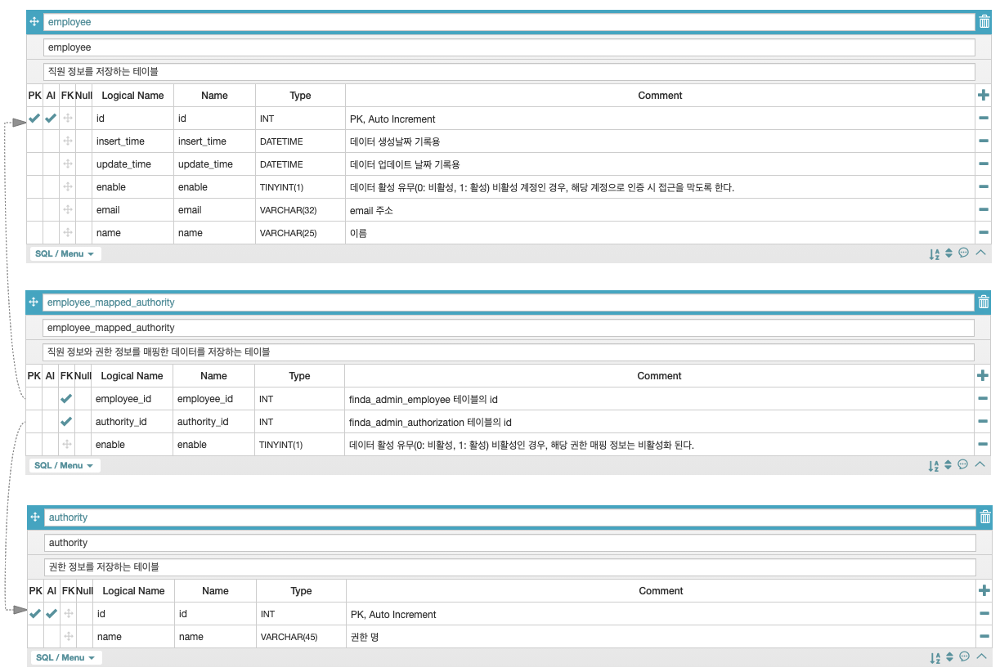

# Spring Security OAuth2 + Google APIs + Json Web Token Example
> 해당 프로젝트는 Spring Security OAuth2.0을 이용하여 구글 로그인을 수행하면 인증 처리를 하고,  
> Json Web Token을 클라이언트에게 전달해주어 세션 관리를 수행할 수 있는 방식을 데모로 시연합니다.


## User Data & Authority DB Scheme ERD




## Init SQL
```
-- '직원 정보를 저장하는 테이블'
CREATE TABLE employee
(
    `id`           INT            NOT NULL    AUTO_INCREMENT COMMENT 'PK, Auto Increment', 
    `insert_time`  DATETIME       NOT NULL    DEFAULT CURRENT_TIMESTAMP COMMENT '데이터 생성날짜 기록용', 
    `update_time`  DATETIME       NOT NULL    DEFAULT CURRENT_TIMESTAMP ON UPDATE CURRENT_TIMESTAMP COMMENT '데이터 업데이트 날짜 기록용', 
    `enable`       TINYINT(1)     NOT NULL    DEFAULT 1 COMMENT '데이터 활성 유무(0: 비활성, 1: 활성) 비활성 계정인 경우, 해당 계정으로 인증 시 접근을 막도록 한다.', 
    `email`        VARCHAR(32)    NOT NULL    COMMENT 'email 주소', 
    `name`         VARCHAR(25)    NOT NULL    COMMENT '이름', 
    PRIMARY KEY (`id`)
) ENGINE=InnoDB AUTO_INCREMENT=0 DEFAULT CHARSET=utf8;


-- '권한 정보를 저장하는 테이블'
CREATE TABLE authority
(
    `id`    INT            NOT NULL    AUTO_INCREMENT COMMENT 'PK, Auto Increment', 
    `name`  VARCHAR(45)    NOT NULL    COMMENT '권한명', 
    PRIMARY KEY (`id`)
) ENGINE=InnoDB AUTO_INCREMENT=0 DEFAULT CHARSET=utf8;


-- '직원 정보와 권한 정보를 매핑한 데이터를 저장하는 테이블'
CREATE TABLE employee_mapped_authority
(
    `employee_id`   INT           NOT NULL    COMMENT 'employee 테이블의 id', 
    `authority_id`  INT           NOT NULL    COMMENT 'authority 테이블의 id', 
    `enable`        TINYINT(1)    NOT NULL    COMMENT '데이터 활성 유무(0: 비활성, 1: 활성) 비활성인 경우, 해당 권한 매핑 정보는 비활성화 된다.'
) ENGINE=InnoDB AUTO_INCREMENT=0 DEFAULT CHARSET=utf8;


ALTER TABLE employee_mapped_authority
    ADD CONSTRAINT FK_employee_mapped_authority_employee_id FOREIGN KEY (employee_id)
        REFERENCES employee (id) ON DELETE RESTRICT ON UPDATE RESTRICT;

ALTER TABLE employee_mapped_authority
    ADD CONSTRAINT FK_employee_mapped_authority_authority_id FOREIGN KEY (authority_id)
        REFERENCES authority (id) ON DELETE RESTRICT ON UPDATE RESTRICT;


-- 테스트 데이터 
INSERT INTO employee(email, name) VALUES ('shinchul@finda.co.kr', '방신철');
INSERT INTO authority(name) VALUES ('access_foo') ,('access_bar');
INSERT INTO employee_mapped_authority VALUES (1,1,1), (1,2,1);


-- 조회 
select 
	e.id 
	, e.email 
	, e.name 
	, a.name 
	, ema.enable
from employee e 
inner join employee_mapped_authority ema on ema.employee_id = e.id 
inner join authority a on a.id = ema.authority_id 
;

```

* * * 

## Build

```
$ mvn clean package
```

* * * 

## Reference

- [참고 링크 1](https://www.callicoder.com/spring-boot-security-oauth2-social-login-part-1/)
- [참고 링크 2](https://www.callicoder.com/spring-boot-security-oauth2-social-login-part-2/)
- [참고 링크 3](https://www.callicoder.com/spring-boot-security-oauth2-social-login-part-3/)
